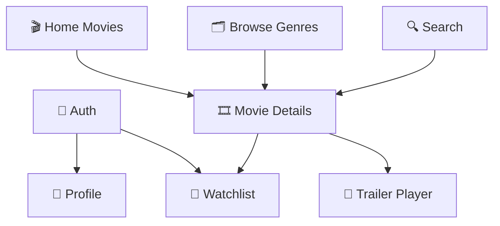

# 📑 Movie App Features Index & Roadmap

This document serves as the central index of all modules/features in the **Movie & Cinema App** (`movie_app`). It tracks the development status, layer components, use cases, state management, and dependencies for each feature.

---

## 📊 Features Status Matrix

| Feature | Description | Status | Domain Layer | Data Layer | Presentation Layer |
| :--- | :--- | :---: | :---: | :---: | :---: |
| [🔐 Authentication (`auth`)](#-1-authentication-feature-auth) | User Login, Registration, Session & Profile | ✅ Completed | ✅ Ready | ✅ Ready | ✅ Ready |
| [🎬 Home & Featured Movies (`home`)](#-2-home--featured-movies-home) | Trending, Popular, Top Rated, Now Playing sliders | ⏳ Planned | ⏳ Planned | ⏳ Planned | ⏳ Planned |
| [🗂️ Movie Genres & Browse (`genres`)](#-3-movie-genres--browse-genres) | Explore by Category (Action, Sci-Fi, Horror, Drama, etc.) | ⏳ Planned | ⏳ Planned | ⏳ Planned | ⏳ Planned |
| [🎞️ Movie Details & Trailer (`details`)](#-4-movie-details--trailer-details) | Overview, Cast, Trailer Player, Rating, Similar Movies | ⏳ Planned | ⏳ Planned | ⏳ Planned | ⏳ Planned |
| [🔍 Search & Filtering (`search`)](#-5-search--filtering-search) | Real-time title search, genre filters, release year | ⏳ Planned | ⏳ Planned | ⏳ Planned | ⏳ Planned |
| [🔖 Watchlist & Favorites (`watchlist`)](#-6-watchlist--favorites-watchlist) | Bookmark movies, offline watch later, mark as watched | ⏳ Planned | ⏳ Planned | ⏳ Planned | ⏳ Planned |
| [👤 User Profile & Settings (`profile`)](#-7-user-profile--settings-profile) | User avatar, watch history, language/theme settings | ⏳ Planned | ⏳ Planned | ⏳ Planned | ⏳ Planned |

*Legend: ✅ Completed | 🚧 In Progress | ⏳ Planned*

---

## 🔐 1. Authentication Feature (`auth`)

- **Path:** `lib/features/auth/`
- **Status:** ✅ Completed (Dark Cinema Theme & Modular Widgets)
- **Purpose:** Handles user sign in, registration, session persistence, and navigation.

### Layer Map:
```text
lib/features/auth/
├── data/
│   ├── data_source/
│   │   ├── data_source.dart            # AuthDataSource (Contract)
│   │   └── data_source_imp.dart        # AuthDataSourceImp (Implementation)
│   ├── models/
│   │   └── user_model.dart             # UserModel (JSON serialization)
│   └── repo/
│       └── repo_imp.dart               # AuthRepoImp (Implements AuthRepo)
├── domain/
│   ├── entity/
│   │   └── user_entity.dart            # UserEntity (Domain model)
│   ├── repo/
│   │   └── repo.dart                   # AuthRepo (Domain contract)
│   └── use_case/
│       ├── login_use_case.dart         # LoginUseCase
│       └── register_use_case.dart      # RegisterUseCase
└── presentation/
    ├── manager/
    │   ├── auth_cubit.dart             # AuthCubit
    │   └── auth_state.dart             # AuthState (loginState, registerState)
    ├── screens/
    │   ├── login_screen.dart           # LoginScreen (Dark Cinema theme)
    │   └── register_screen.dart        # RegisterScreen (Dark Cinema theme)
    └── widgets/
        ├── auth_button_widget.dart     # AuthButtonWidget (Cinema Gold button)
        ├── auth_header_widget.dart     # AuthHeaderWidget (Title & subtitle header)
        ├── auth_prompt_row.dart        # AuthPromptRow ("Don't have an account? Create Account")
        ├── custom_text_field.dart      # CustomTextField (Dark card input with gold focus)
        ├── forgot_password_widget.dart # ForgotPasswordWidget (Gold accent link)
        ├── login_form_widget.dart      # LoginFormWidget (Encapsulated login form)
        ├── register_form_widget.dart   # RegisterFormWidget (Encapsulated register form)
        └── route_logo_widget.dart      # RouteLogoWidget / MovieLogoWidget (Movie branding)
```

---

## 🎬 2. Home & Featured Movies (`home`)

- **Path:** `lib/features/home/`
- **Status:** ⏳ Planned
- **Purpose:** Display featured movie carousel, Trending Today, Top Rated, and Upcoming releases.

### Layer Map:
```text
lib/features/home/
├── data/
│   ├── data_source/                    # MoviesRemoteDataSource (TMDB API)
│   ├── models/                         # MovieModel, MovieResponseModel
│   └── repo/                           # MoviesRepoImp
├── domain/
│   ├── entity/                         # MovieEntity
│   ├── repo/                           # MoviesRepo (Contract)
│   └── use_case/
│       ├── get_trending_movies_use_case.dart
│       ├── get_popular_movies_use_case.dart
│       ├── get_top_rated_movies_use_case.dart
│       └── get_now_playing_movies_use_case.dart
└── presentation/
    ├── manager/                        # HomeCubit, HomeState
    ├── screens/                        # HomeScreen, MainLayoutScreen
    └── widgets/                        # MovieCarouselSlider, MovieSectionList, MoviePosterCard
```

---

## 🗂️ 3. Movie Genres & Browse (`genres`)

- **Path:** `lib/features/genres/`
- **Status:** ⏳ Planned
- **Purpose:** Categorize and explore movies by genre (Action, Adventure, Sci-Fi, Drama, Horror, Comedy, etc.).

### Layer Map:
```text
lib/features/genres/
├── data/
│   ├── data_source/                    # GenresDataSource
│   ├── models/                         # GenreModel
│   └── repo/                           # GenresRepoImp
├── domain/
│   ├── entity/                         # GenreEntity
│   ├── repo/                           # GenresRepo
│   └── use_case/                       # GetGenresUseCase, GetMoviesByGenreUseCase
└── presentation/
    ├── manager/                        # GenresCubit, GenresState
    ├── screens/                        # BrowseScreen, GenreMoviesScreen
    └── widgets/                        # GenreCardWidget, GenreChipWidget
```

---

## 🎞️ 4. Movie Details & Trailer (`details`)

- **Path:** `lib/features/details/`
- **Status:** ⏳ Planned
- **Purpose:** In-depth movie view: HD backdrop, cast & crew, video trailer player, synopsis, runtime, ratings, and similar movies.

### Layer Map:
```text
lib/features/details/
├── data/
│   ├── data_source/                    # MovieDetailsDataSource
│   ├── models/                         # MovieDetailsModel, CastModel, TrailerModel
│   └── repo/                           # MovieDetailsRepoImp
├── domain/
│   ├── entity/                         # MovieDetailsEntity, CastEntity, TrailerEntity
│   ├── repo/                           # MovieDetailsRepo
│   └── use_case/
│       ├── get_movie_details_use_case.dart
│       ├── get_movie_cast_use_case.dart
│       ├── get_movie_trailers_use_case.dart
│       └── get_similar_movies_use_case.dart
└── presentation/
    ├── manager/                        # DetailsCubit, DetailsState
    ├── screens/                        # MovieDetailsScreen
    └── widgets/                        # BackdropHeaderWidget, TrailerPlayerWidget, CastListWidget, SimilarMoviesWidget
```

---

## 🔍 5. Search & Filtering (`search`)

- **Path:** `lib/features/search/`
- **Status:** ⏳ Planned
- **Purpose:** Fast keyword search with debounce, search history, year filter, rating filter, and genre filter.

### Layer Map:
```text
lib/features/search/
├── data/
│   ├── data_source/                    # SearchDataSource
│   ├── models/                         # SearchResultModel
│   └── repo/                           # SearchRepoImp
├── domain/
│   ├── entity/                         # SearchMovieEntity
│   ├── repo/                           # SearchRepo
│   └── use_case/                       # SearchMoviesUseCase, GetSearchHistoryUseCase
└── presentation/
    ├── manager/                        # SearchCubit, SearchState
    ├── screens/                        # SearchScreen
    └── widgets/                        # SearchBarWidget, MovieSearchResultTile, RecentSearchItem
```

---

## 🔖 6. Watchlist & Favorites (`watchlist`)

- **Path:** `lib/features/watchlist/`
- **Status:** ⏳ Planned
- **Purpose:** Save movies to a personal watchlist, manage favorites, offline storage using Hive / SharedPreferences.

### Layer Map:
```text
lib/features/watchlist/
├── data/
│   ├── data_source/                    # WatchlistLocalDataSource (Hive/DB)
│   ├── models/                         # WatchlistModel
│   └── repo/                           # WatchlistRepoImp
├── domain/
│   ├── entity/                         # WatchlistItemEntity
│   ├── repo/                           # WatchlistRepo
│   └── use_case/
│       ├── get_watchlist_use_case.dart
│       ├── add_to_watchlist_use_case.dart
│       ├── remove_from_watchlist_use_case.dart
│       └── check_is_favorite_use_case.dart
└── presentation/
    ├── manager/                        # WatchlistCubit, WatchlistState
    ├── screens/                        # WatchlistScreen
    └── widgets/                        # WatchlistTileWidget, BookmarkButtonWidget
```

---

## 👤 7. User Profile & Settings (`profile`)

- **Path:** `lib/features/profile/`
- **Status:** ⏳ Planned
- **Purpose:** User avatar, watch history stats, preferred genres, app language & dark theme preferences.

---

## 🔗 Feature Inter-Dependency Map


