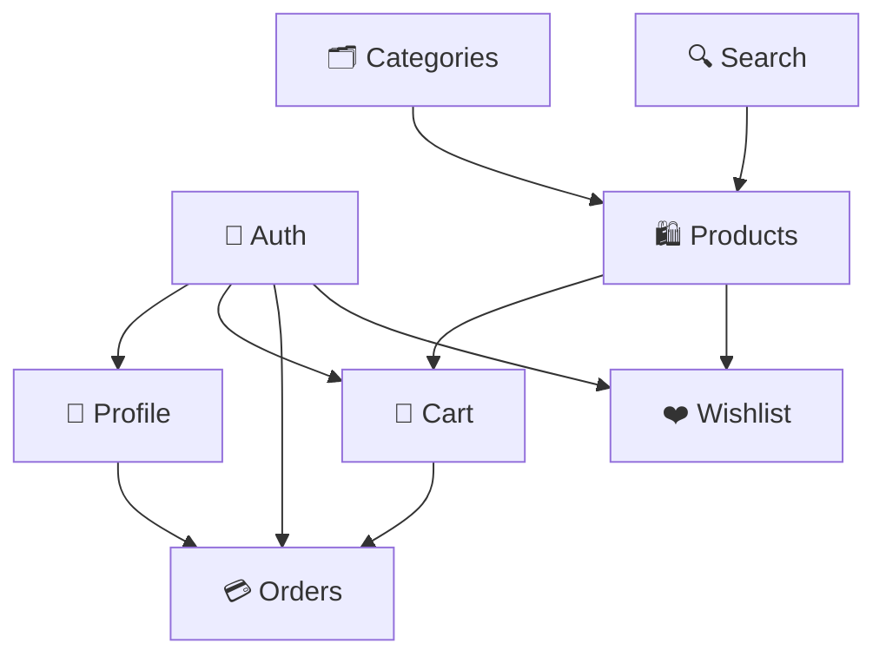

# 📑 Features Index & Roadmap

This document serves as the central index of all modules/features in the **E-Commerce App**. It tracks the development status, layer components, use cases, state management, and dependencies for each feature.

---

## 📊 Features Status Matrix

| Feature | Description | Status | Domain Layer | Data Layer | Presentation Layer |
| :--- | :--- | :---: | :---: | :---: | :---: |
| [🔐 Authentication (`auth`)](#-1-authentication-feature-auth) | Login, Register, Password Reset & Token Management | ✅ Completed | ✅ Ready | ✅ Ready | ✅ Ready |
| [🛍️ Products & Catalog (`products`)](#-2-products--catalog-feature-products) | Browse products, product details, ratings, & stock | ⏳ Planned | ⏳ Planned | ⏳ Planned | ⏳ Planned |
| [🗂️ Categories (`categories`)](#-3-categories-feature-categories) | Category & sub-category exploration | ⏳ Planned | ⏳ Planned | ⏳ Planned | ⏳ Planned |
| [🛒 Shopping Cart (`cart`)](#-4-shopping-cart-feature-cart) | Add/remove items, update quantities, cart summary | ⏳ Planned | ⏳ Planned | ⏳ Planned | ⏳ Planned |
| [❤️ Wishlist / Favorites (`wishlist`)](#-5-wishlist--favorites-feature-wishlist) | Save favorite items for quick access | ⏳ Planned | ⏳ Planned | ⏳ Planned | ⏳ Planned |
| [💳 Checkout & Orders (`orders`)](#-6-checkout--orders-feature-orders) | Order placement, shipping address, payment, history | ⏳ Planned | ⏳ Planned | ⏳ Planned | ⏳ Planned |
| [👤 Profile & Settings (`profile`)](#-7-profile--account-feature-profile) | User profile, edit info, address book, preferences | ⏳ Planned | ⏳ Planned | ⏳ Planned | ⏳ Planned |
| [🔍 Search & Filtering (`search`)](#-8-search--filter-feature-search) | Keyword search, auto-suggestions, sort & filter | ⏳ Planned | ⏳ Planned | ⏳ Planned | ⏳ Planned |

*Legend: ✅ Completed | 🚧 In Progress | ⏳ Planned*

---

## 🔐 1. Authentication Feature (`auth`)

- **Path:** [`lib/features/auth/`](file:///f:/ROUTE%202026/flutter%20project/e_commerce_app/lib/features/auth)
- **Status:** ✅ Completed (Login & Register Flows with Modular Widgets)
- **Purpose:** Handles user identity, registration, login, and session persistence.

### Layer Map:
```text
lib/features/auth/
├── data/
│   ├── data_source/
│   │   ├── data_source.dart            # AuthDataSource (Contract)
│   │   └── data_source_imp.dart        # AuthDataSourceImp (API implementation)
│   ├── models/
│   │   └── user_model.dart             # UserModel (JSON serialization)
│   └── repo/
│       └── repo_imp.dart               # AuthRepoImp (Implements AuthRepo)
├── domain/
│   ├── entity/
│   │   └── user_entity.dart            # UserEntity (Domain model)
│   ├── repo/
│   │   └── repo.dart                   # AuthRepo (Domain contract)
│   └── use_case/
│       ├── login_use_case.dart         # LoginUseCase
│       └── register_use_case.dart      # RegisterUseCase
└── presentation/
    ├── manager/
    │   ├── auth_cubit.dart             # AuthCubit
    │   └── auth_state.dart             # AuthState (loginState, registerState)
    ├── screens/
    │   ├── login_screen.dart           # LoginScreen (Composed of modular single-widget files)
    │   └── register_screen.dart        # RegisterScreen (Composed of modular single-widget files)
    └── widgets/
        ├── auth_button_widget.dart     # AuthButtonWidget (Action button with loading spinner)
        ├── auth_header_widget.dart     # AuthHeaderWidget (Title & Subtitle header)
        ├── auth_prompt_row.dart        # AuthPromptRow ("Don't have an account? Sign up")
        ├── custom_text_field.dart      # CustomTextField (Styled input field with password toggle)
        ├── forgot_password_widget.dart # ForgotPasswordWidget ("Forgot password" clickable link)
        ├── login_form_widget.dart      # LoginFormWidget (Encapsulated login form & validation)
        ├── register_form_widget.dart   # RegisterFormWidget (Encapsulated register form & validation)
        └── route_logo_widget.dart      # RouteLogoWidget ("ROUTE" header branding)
```

### Implemented Use Cases & Operations:
- `LoginUseCase`: Authenticates user credentials via email/password.
- `RegisterUseCase`: Registers a new user account with validation (name, email, password, rePassword, phone).

---

## 🛍️ 2. Products & Catalog Feature (`products`)

- **Path:** `lib/features/products/`
- **Status:** ⏳ Planned
- **Purpose:** Displays product catalog, detailed product view, ratings, and stock status.

### Layer Map:
```text
lib/features/products/
├── data/
│   ├── data_source/                  # RemoteProductsDataSource (REST API)
│   ├── models/                       # ProductModel (JSON parsing)
│   └── repo/                         # ProductsRepoImp
├── domain/
│   ├── entity/                       # ProductEntity
│   ├── repo/                         # ProductsRepo (Contract)
│   └── use_case/
│       ├── get_products_use_case.dart
│       ├── get_product_details_use_case.dart
│       └── get_featured_products_use_case.dart
└── presentation/
    ├── manager/                      # ProductsCubit, ProductsState
    ├── screens/                      # HomeScreen, ProductDetailsScreen
    └── widgets/                      # ProductCard, ProductRating, ProductImageGallery
```

---

## 🗂️ 3. Categories Feature (`categories`)

- **Path:** `lib/features/categories/`
- **Status:** ⏳ Planned
- **Purpose:** Categorize items and allow users to browse products by specific category or brand.

### Layer Map:
```text
lib/features/categories/
├── data/
│   ├── data_source/                  # CategoriesDataSource
│   ├── models/                       # CategoryModel
│   └── repo/                         # CategoriesRepoImp
├── domain/
│   ├── entity/                       # CategoryEntity
│   ├── repo/                         # CategoriesRepo
│   └── use_case/                     # GetCategoriesUseCase, GetCategoryProductsUseCase
└── presentation/
    ├── manager/                      # CategoriesCubit, CategoriesState
    ├── screens/                      # CategoriesScreen, SubCategoriesScreen
    └── widgets/                      # CategoryItemCard, CategoryChip
```

---

## 🛒 4. Shopping Cart Feature (`cart`)

- **Path:** `lib/features/cart/`
- **Status:** ⏳ Planned
- **Purpose:** Manage items added to the cart, quantity adjustments, discount codes, and price calculation.

### Layer Map:
```text
lib/features/cart/
├── data/
│   ├── data_source/                  # CartRemoteDataSource & CartLocalDataSource
│   ├── models/                       # CartModel, CartItemModel
│   └── repo/                         # CartRepoImp
├── domain/
│   ├── entity/                       # CartEntity, CartItemEntity
│   ├── repo/                         # CartRepo
│   └── use_case/
│       ├── get_cart_use_case.dart
│       ├── add_to_cart_use_case.dart
│       ├── update_quantity_use_case.dart
│       └── remove_from_cart_use_case.dart
└── presentation/
    ├── manager/                      # CartCubit, CartState
    ├── screens/                      # CartScreen
    └── widgets/                      # CartItemWidget, PriceSummaryWidget, CheckoutFloatingBar
```

---

## ❤️ 5. Wishlist / Favorites Feature (`wishlist`)

- **Path:** `lib/features/wishlist/`
- **Status:** ⏳ Planned
- **Purpose:** Allow users to bookmark products to a personalized favorites list.

### Layer Map:
```text
lib/features/wishlist/
├── data/
│   ├── data_source/                  # WishlistDataSource
│   ├── models/                       # WishlistItemModel
│   └── repo/                         # WishlistRepoImp
├── domain/
│   ├── entity/                       # WishlistItemEntity
│   ├── repo/                         # WishlistRepo
│   └── use_case/                     # GetWishlistUseCase, ToggleFavoriteUseCase
└── presentation/
    ├── manager/                      # WishlistCubit, WishlistState
    ├── screens/                      # WishlistScreen
    └── widgets/                      # WishlistItemCard, FavoriteButton
```

---

## 💳 6. Checkout & Orders Feature (`orders`)

- **Path:** `lib/features/orders/`
- **Status:** ⏳ Planned
- **Purpose:** Manage the checkout process, shipping addresses, payment gateway integration, and order tracking history.

### Layer Map:
```text
lib/features/orders/
├── data/
│   ├── data_source/                  # OrdersDataSource, PaymentDataSource
│   ├── models/                       # OrderModel, OrderItemModel
│   └── repo/                         # OrdersRepoImp
├── domain/
│   ├── entity/                       # OrderEntity, OrderItemEntity
│   ├── repo/                         # OrdersRepo
│   └── use_case/
│       ├── create_order_use_case.dart
│       ├── get_orders_history_use_case.dart
│       └── get_order_details_use_case.dart
└── presentation/
    ├── manager/                      # CheckoutCubit, OrdersCubit
    ├── screens/                      # CheckoutScreen, OrderSuccessScreen, OrdersHistoryScreen
    └── widgets/                      # AddressCard, PaymentMethodTile, OrderStatusTracker
```

---

## 👤 7. Profile & Account Feature (`profile`)

- **Path:** `lib/features/profile/`
- **Status:** ⏳ Planned
- **Purpose:** Display and manage user profile details, saved addresses, language/theme settings, and app info.

### Layer Map:
```text
lib/features/profile/
├── data/
│   ├── data_source/                  # ProfileDataSource
│   ├── models/                       # ProfileModel, AddressModel
│   └── repo/                         # ProfileRepoImp
├── domain/
│   ├── entity/                       # ProfileEntity, AddressEntity
│   ├── repo/                         # ProfileRepo
│   └── use_case/                     # GetProfileUseCase, UpdateProfileUseCase, ManageAddressUseCase
└── presentation/
    ├── manager/                      # ProfileCubit, ProfileState
    ├── screens/                      # ProfileScreen, EditProfileScreen, AddressBookScreen
    └── widgets/                      # ProfileHeader, SettingsTile, AddressCard
```

---

## 🔍 8. Search & Filter Feature (`search`)

- **Path:** `lib/features/search/`
- **Status:** ⏳ Planned
- **Purpose:** Provide text search, search history, auto-completion, and multi-criteria filters (price, brand, category, rating).

### Layer Map:
```text
lib/features/search/
├── data/
│   ├── data_source/                  # SearchDataSource
│   ├── models/                       # SearchResultModel
│   └── repo/                         # SearchRepoImp
├── domain/
│   ├── entity/                       # SearchFilterEntity
│   ├── repo/                         # SearchRepo
│   └── use_case/                     # SearchProductsUseCase, GetRecentSearchesUseCase
└── presentation/
    ├── manager/                      # SearchCubit, SearchState
    ├── screens/                      # SearchScreen, FilterBottomSheet
    └── widgets/                      # SearchBarWidget, RecentSearchChip, FilterOptionTile
```

---

## 🔗 Feature Inter-Dependency Map


